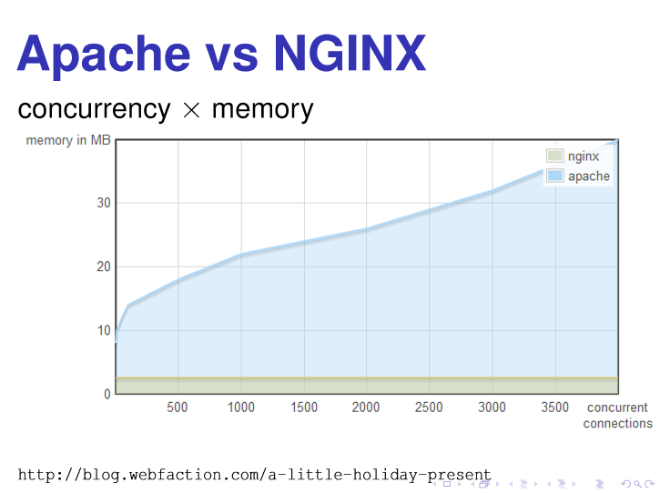
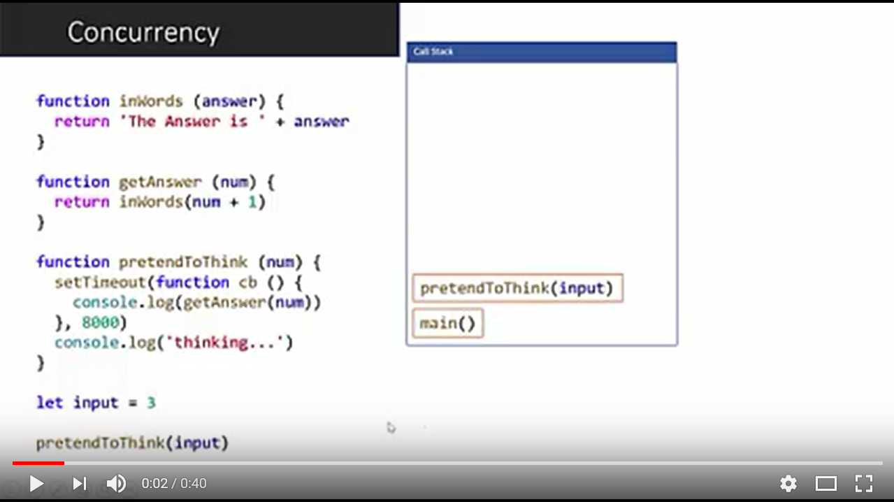

# Async

## What do we mean by synchronous and asynchronous?
When you execute something <strong>synchronously</strong>, you wait for it to finish before moving on to another task.  

When you execute something <strong>asynchronously</strong>, you can execute other tasks while you are waiting for it to finish.  

## Why did Ryan Dahl choose Javascript for Node?
Ryan Dahl is the creator of node.js, and his original presentation on it is here: http://bit.ly/original-nodejs 

He showed a [graph of Apache vs. NGINX](https://youtu.be/ztspvPYybIY?t=4m46s) and their concurrency vs. memory.  Apache uses lots of memory when it has lots of concurrent clients, but NGINX uses a flat consistent amount no matter how many concurrent clients.  The difference: Apache uses one thread per connection, and NGINX uses event loops.  For massive concurrency, we cannot use an OS thread for each connection.  
+ Context switching is not free (takes CPU time)
+ Each thread/execution stacks take up memory


> The blue is Apache and the green is NGINX, plotting memory usage vs. number of concurrent connections.  


We're taught I/O with this:

```javascript
puts("Enter your name: ");
var name = gets();
puts("Name: " + name);
```

We're taught to demand input and do nothing until we have it.  

Code like

```javascript
puts("Enter your name: ");
gets(function (name) {
    puts("Name: " + name);
});
```

is rejected as too complicated.  

<strong>Short answer: Ryan was convinced that depending on the leaky abstraction layer of context switching in multiple threads is not good.  We need an event loop and callbacks.</strong>  

## Callbacks


A callback is a piece of code which is passed as an argument to some other code.  


## Single Threaded
Javascript is single-threaded.  That means it has only one call stack and one event loop!
+ Event loop watches the callback queue and the call stack
+ If the call stack is empty, and there is something in the callback queue, the event loop puts the callback function in the call stack.  

[](https://www.youtube.com/watch?v=YgZRAqkLXnA)

This has led to callback hell.  

```javascript
puts('Enter your name: ')
gets(function (name) {
  puts('Name: ' + name)
  puts('Enter your email: ')
  gets(function (email) {
    puts('Email: ' + name)
    puts('Enter your phone number: ')
    gets(function (phone) {
      puts('Phone: ' + phone)
      puts('Enter your birth date: ')
      gets(function (birthDate) {
        puts('Birth Date: ' + birthDate)
      })
    })
  })
})
```

We can use async/await to solve this.  While these method calls look synchronous, it is actually still async behind the scenes.

```javascript
async function program () {
  puts('Enter your name: ')
  var name = await gets()
  puts('Name: ' + name)
  puts('Enter your Email: ')
  var email = await gets()
  puts('Email: ' + email)
  puts('Enter your Phone: ')
  var phone = await gets()
  puts('Phone: ' + phone)
  puts('Enter your Birth Date: ')
  var date = await gets()
  puts('Date: ' + date)
}
```

## Promises
A promise is a value that guarantees a future value.  

In Javascript ES6, a promise is an object that has a `then` method on it.  When instantiating a promise object, it takes in a function that has 2 callback parameters (`resolve` and `reject`).  

```javascript
var requestName = new Promise(function (resolve) {
  puts('Enter Your Name: ')
  gets(function (name) {
    resolve(name)
  })
})
requestName.then(function (name) {
  console.log(name)
})
```

+ The `then` method always returns a Promise
+ The `then` method takes 2 functions as parameters
+ The first function is the `resolve` function

When we write things in promises, it has two effects:
1. You notice that the triangle shape of callback hell is gone.
2. The nested functions are broken out into two areas: Promise Declaration (which defines the async operations) and Promise Utilization (which is your application logic).  

Before:
```javascript
puts('Enter your name: ')
gets(function (name) {
  puts('Name: ' + name)
  puts('Enter your email: ')
  gets(function (email) {
    puts('Email: ' + name)
    puts('Enter your phone number: ')
    gets(function (phone) {
      puts('Phone: ' + phone)
      puts('Enter your birth date: ')
      gets(function (birthDate) {
        puts('Birth Date: ' + birthDate)
      })
    })
  })
})
```

After:
```javascript
function requestName () {
  return new Promise(function (resolve) {
    puts('Enter Your Name: ')
    gets(function (name) {
      resolve(name)
    })
  })
}

function requestEmail () {
  return new Promise(function (resolve) {
    puts('Enter Your Email: ')
    gets(function (email) {
      resolve(email)
    })
  })
}

// ...

requestName()
  .then(function (name) {
    puts('Name: ' + name)
  })
  .then(requestEmail)
  .then(function (email) {
    puts('Email: ' + email)
  })
  .then(requestPhone)
  .then(function (phone) {
    puts('Phone: ' + phone)
  })
  .then(requestBirthDate)
  .then(function (birthDate) {
    puts('Birth Date: ' + birthDate)
  })
```

## Generators
Generators are a way to create iterators.  They were created to save memory on an iterable data structure and operations handling them.
+ Use `function *` and `yield`.  
+ Generators are inherently synchronous.
+ A generator function returns an iterator object.  
+ An iterator object has a `next` method on it.  
+ The `next` method runs/continues the generator function up to `yield`.
+ The `next` method returns an object that has two parameters `value` and `done`.  

```javascript
function * countdown() {
    puts('Fuel Check');
    yield 3;

    puts('Engine Check');
    yield 2;

    puts('Electrical Check');
    yield 1;

    puts('Launching...');
}

var iterator = countdown();  // object that has a next method on it

var yieldedResult = iterator.next();    // { value: 3, done: false}
puts(yieldedResult.value);

yieldedResult = iterator.next();    // { value: 2, done: false}
puts(yieldedResult.value);

yieldedResult = iterator.next();    // { value: 1, done: false}
puts(yieldedResult.value);

yieldedResult = iterator.next();    // { value: undefined, done: true}
puts(yieldedResult.value);
```

## async/await
> Relationship between async/await and Promises and Generators

```javascript
async function program () {
  puts('Enter your name: ')
  var name = await gets()
  puts('Name: ' + name)
  puts('Enter your Email: ')
  var email = await gets()
  puts('Email: ' + email)
  puts('Enter your Phone: ')
  var phone = await gets()
  puts('Phone: ' + phone)
  puts('Enter your Birth Date: ')
  var date = await gets()
  puts('Date: ' + date)
}
```

vs.

```javascript
function * program () {
  puts('Enter your Name: ')
  var name = yield gets()
  puts('Name: ' + name)
  puts('Enter your Email: ')
  var email = yield gets()
  puts('Email: ' + email)
  puts('Enter your Phone: ')
  var phone = yield gets()
  puts('Phone: ' + phone)
  puts('Enter your Birth Date: ')
  var date = yield gets()
  puts('Birth Date: ' + date)
}

```


## Technical Challenge
Link to challenge: https://github.com/jennifermarsman/JavaScriptElevatorChallenge

# Resources
* [Original Talk on NodeJS by Ryan Dahl](https://www.youtube.com/watch?v=ztspvPYybIY)
* [Original Slides on NodeJS by Ryan Dahl](http://bit.ly/original-nodejs-slides)
* [Event loop explained by Philip Roberts](http://bit.ly/eventloop-explained)
* [Article on generators and async/await](https://davidwalsh.name/es6-generators)
* [Explaining async code samples by Hao Luo](https://github.com/howlowck/explaining-async)
* [NodeSchool tutorials](https://nodeschool.io/) - specifically, check out `promise-it-wont-hurt` and `async-you`
