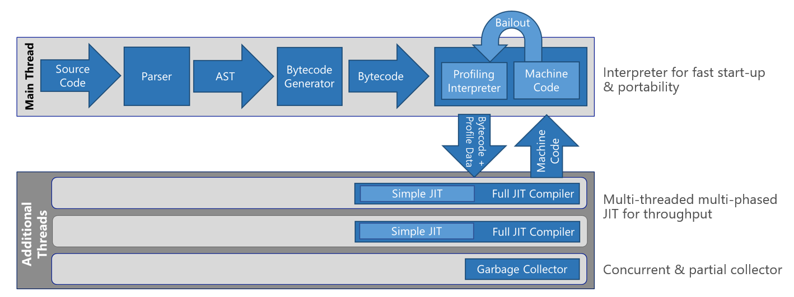
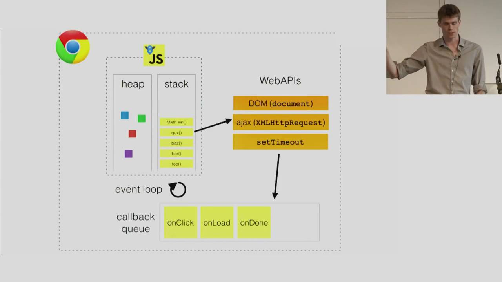

# Engines, runtimes, and you: A behind-the-scenes look at how Javascript Javascripts
Let's take a look at how the browser works to turn `const code = 'javascript';` into the meaningful array of wiggling electrons that makes up your favorite website.


## The Javascript engine
Javascript is hard. But if it makes you feel better, your computer doesn't understand Javascript, either. **Javascript engines** are programs that convert Javascript source code into something your computer can understand and execute. Modern browsers contain Javascript engines. So does Node.js.

### A brief history of the Javascript engine
The first Javascript engine was SpiderMonkey, created in 1996 for Netscape Navigator. SpiderMonkey was written in C/C++ by Brendan Eich, who also wrote Javascript ([purportedly in the span of ten days](https://brendaneich.com/2011/06/new-javascript-engine-module-owner/)).

### Interpreted or compiled?
The first version of SpiderMonkey was simply a Javascript *interpreter.* An interpreter takes human-friendly Javascript source code, converts it to a machine-friendly intermediate, and executes it immediately. Interpretation doesn't literally happen line by line because Javascript and intermediate machine code are pretty different, and the interpreter needs to "look ahead" to get the full context of the Javascript source code. But for our purposes, we can think of interpretation as roughly "execute-as-you-go." One downside of interpretation is that because it's a one-pass process, it doesn't do any sort of code optimization that might make it run faster. (In the early days, execution speed wasn't a big deal anyway... Javascript scripts were limited to a few lines to help enhance websites.)

Over time, SpiderMonkey was paired up with a JIT ("just-in-time") *compiler*. A Javascript compiler, like compilers for other languages such as C++, converts all the source code to machine code before executing anything. The conversion isn't direct. In the case of Javascript, the code first goes through a syntactical analysis called parsing, and an AST (abstract syntax tree) is generated. Parsing identifies which parts of the code are keywords, which parts are variable names, which parts are function names, which parts are operands, and so on and so forth. The AST, in turn, is used to generate bytecode, which is a somewhat human-readable set of instructions that is closer to machine code. That, in turn, gets compiled to machine code that the client's CPU can execute. You can think of machine code as looking like assembly language commands or sets of hexidecimal (base-16) numbers or even sets of 1s and 0s; they are all interchangeable at a 1-to-1 level. The Javascript engine in the browser you're using right now contains a compiler specific to your CPU architecture. (You had to choose which platform you wanted to install Chrome or Firefox on, right?)

Today's modern browsers like Chrome and Edge contain engines (V8 and Chakra, respectively) that have a pretty complex execution pipeline. Here's the Chakra pipeline as illustrated on [the Microsoft Edge Developer blog](https://blogs.windows.com/msedgedev/2015/12/05/open-source-chakra-core/).



The first steps should look familiar: parsing the source code produces an AST, then the AST is used to generate bytecode, and finally, something something something, machine code! That "something something something" is the engine being smart about balancing optimization, fast execution time, and fast start-up time. The benefit of JIT compiling is that the code is optimized and runs fast. However, there's some startup cost because the parsing and optimization takes time. Chrome and Edge each have their own ways of being smart about this. [This blog post](http://voidcanvas.com/is-javascript-really-interpreted-or-compiled-language/) by Paul Shan articulates it well:

 > In JavaScript if a certain piece of code is run more than once, it’s called warm. When a function starts gets warmer, JIT sends it for compilation and saves the compiled code with a version. From next time if the same code is executed, it skips the translation and directly executes the compiled code. This speeds up the performance. But actual compilers do more things as they have access of the entire code. If a warm code become hot and hotter, JIT tries to optimize it more and more and starts saving with versions. In this process the optimizing compiler makes some assumptions about the type of the variables and the environmental values; but any unmatched assumption reverts back the optimization attempt, but with right one, it makes the code way better and performant.

Here, the "unmatched assumption reverting back" to a deoptimized version is what's listed as "bailout" in the diagram. Neat! We'll talk more about optimization later.

So, whatever happened to Netscape Navigator's trusted SpiderMonkey, you ask? It's part of Firefox's Javascript engine, where it works alongside the IonMonkey JIT compiler.


## The Javascript runtime

Ask 10 people for a definition of "Javascript runtime," and you're likely to get 10 different answers. Developers aren't always consistent in what exactly they mean when they say runtime, so let's disambiguate a bit...

### Defining "at runtime"

When we say that some bit of Javascript is compiled *at runtime,* we mean that it's compiled immediately before being run. This is in contrast to, for example, a C++ program in which the entirety of the source code is compiled but not run, resulting in an executable file that can then execute at some later time. OK, cool; that makes sense.

### Defining "a Javascript runtime"

When someone talks about a *Javascript runtime,* they might be referring to one or more of the following:
 - the Javascript engine (*e.g.,* V8)
 - a piece of software that contains a Javascript engine (*e.g.,* Node.js or Chrome)
 - services carried out (by a browser, for instance) during runtime such as garbage collection or event queueing
 - the actual pointers and memory allocated during runtime services (*e.g.,* the call stack and heap)
 - objects made available (by a browser, for instance) during runtime such as `window`

Why can't we have some consistency, y'all? Even Mozilla, Google, and Microsoft define "Javascript runtime" in surprisingly different terms in their own documentation. Seriously?!

### So, what's the takeaway?
Whatever it's called, the important thing to know is that there's more to running Javascript in the browser than just interpreting and compiling.


## The good stuff: What the browser actually does with your Javascript

### Heap and call stack
The *heap* is where Javascript allocates objects in memory. It worries about where exactly in memory `const code` lives so that you don't have to. Because, c'mon, you don't care where it is, do you? 

The *call stack* is a data structure that stores a lineup of functions on deck to be executed. When a function is called, it's put at the top of the stack. If that function references a second function, the second function gets put at the top of the stack. When the second function returns, it is removed from the stack. Then, when the first function returns, it is removed from the stack. The call stack keeps track of where we are in a program from an execution perspective. 

Think about it: Javascript doesn't execute in line order. 

```javascript
function double(x) {
    return (x * 2);
}

console.log(double(3));
```

The first few lines define the function `double()`, but it isn't called until several lines later.

### Web APIs, callback queue, and event loop

If running Javascript were just a matter of pushing to and popping off the stack, Javascript execution would be pretty simple and pretty... single-threaded. The browser would do one thing, and when that thing were to finish, it would do the next thing, and so on. As it turns out, this is not ideal for the web. Think about making a REST call. Do you really want everything in the browser to hang while you're waiting on a gigantic JSON return? Nah, fam.



The above diagram shows how the heap and call stack interact with a few other components, namely the browser's *Web APIs*, *callback queue,* and *event loop*. It's a slide from Philip Roberts excellent talk called [Help, I'm stuck in an event loop](https://vimeo.com/96425312). You should really watch it!

As it turns out, some of the Javascript you write for the web is not part of the ECMAScript specification at all. Certain functionality (object access) is granted by way of interfacing with the browser's Web APIs. And here you thought you were writing ~real, pure Javascript~ this whole time. A big list of Web APIs can be found [here](https://developer.mozilla.org/en-US/docs/Web/API). It includes things like `Window`, `setTimeout` and `XMLHttpRequest`. (Since Web APIs are part of the browser's magic, they don't line up in a 1:1 way with the functionality of Node.js.)

Interactions with Web API objects are handled by the browser in a clever way to keep slower tasks from blocking your Javascript execution. Consider an `XMLHttpRequest`. It gets pushed to the stack. We don't really want to hold up the rest of our browser rendering and UI on this request finishing. Fortunately, it's a Web API object. It gets taken off the stack immediately so execution can continue. The browser handles the request and places it in the *callback queue*. You can think of the callback queue like a waiting area. Whatever is in the queue will get pushed to the stack (FIFO order) *only when the stack is clear*. This process of moving objects from the callback queue to the call stack is called the *event loop.*

### Render queue, garbage collection, and more
There are actually a few other doodads that provide functionality within the Javascript engine (like garbage collection) and the browser (like the render queue). Check the resources at the end of this page for more information!

### See it all in action with Loupe
Philip Roberts created a browser tool called [Loupe](http://latentflip.com/loupe/) to help visualize exactly how source code, the call stack, Web APIs, callback queue, and render queue interoperate. It's really cool! You can try it out by visiting [http://latentflip.com/loupe/](http://latentflip.com/loupe/). I recommend clicking the Loupe icon at the top left and increasing the delay to about 2000 ms and enabling render simulation. Once you've done that, click "Save & Run" to kick off the script. You can click the "Click me!" button to trigger click events. Watch them move between Web API handling, the queue, and the stack.


## Why it matters: Optimizing, unblocking, and debugging
You might be thinking, "Wow, browsers are complicated. I would like to forget I ever learned any of this." However, understanding how Javascript is executed by the browser actually has a few real uses.

If you know the interplay of interpretation, compilation, and optimization that takes place in a Javascript engine in the browser, you can actually write code that will execute faster! Here are a few examples:

 - Theoretically, `constant = 5;`should execute more slowly than `zonstant = 5;` because the parsing step that sniffs out the grammar of the code will have to iterate through the first six letters of the variable name to realize that it's a variable name and not the keyword `const`.
 - Because of the way Javascript engines optimize through assumptions about the shape of data, code with objects whose properties vary will execute more slowly than code with objects whose properties are the same. If you have objects that represent people's names, for example, and 5% of people don't have a middle name, it is more efficient to let those objects have a `middlename: undefined` property than to exclude the property altogether. 

By understanding the Javascript engine/runtime, you'll also be able to take better advantage of Web APIs, keeping your execution unblocked and getting more "multithreadedness" out of your code.

And finally, perhaps now the call stack portion of a Javascript debugger makes a little more sense. 

## Technical challenge

### Part 1
As we learned today, V8 and ChakraCore take advantage of blended interpretation/compilation, including a first pass that compiles to machine code. In theory, you should be able to write some simple Javascript, pass it through one of these engines, and get some assembly or bytecode out the other end. Right? Let's try it out!

Up until now, we've been talking about V8 in the browser (Chrome). But for our purposes,getting at V8 via Node.js will be the easiest way to dive in and look at some bytecode.

1. Make sure you have Node.js version 8.3 or higher installed. (Run `node --version` to check. If you need to upgrade for Windows, use the MSI installed from the [Node website](http://www.nodejs.org).)

2. Create a new file on your machine called `test.js`, and paste in the following Javascript code:
```javascript
function incrementX(obj) {
    return 1 + obj.x;
} 
incrementX({x: 42});
```

3. At the Node command prompt, cd into the folder where `test.js` is located, and run `node --print-bytecode test.js`. You'll see lots of text whirring by. Give it 2 minutes or so to finish.

4. Once it's complete, scroll up a few hundred lines. You're looking for a bit of printout that begins with the following:
```
[generating bytecode for function: incrementX]
Parameter count 2
Frame size 8
```

5. The code that follows is the bytecode for the function `incrementX` that appears in `test.js`. Awesome! The middle column shows 1s and 0s (in hexidecimal notation for ease of reading), and the column on the right shows bytecode, which is pretty darn close to what the machine code or assembly would look like.

6. Take a look at [Understanding V8's bytecode](https://medium.com/dailyjs/understanding-v8s-bytecode-317d46c94775), an article that actually goes through the code you entered into `test.js` line by line to explain how the values are loaded in the accumulator, moved to different registers, and made to undergo various operations. See if you can match up the explanations of each line of bytecode with the output you generated. (Note that this article uses an older version of Node, so some of the output and vector designations will look a little different.) Finally, take a moment to observe patterns in the hexidecimal number column. Notice how both references to register 0 contain an `0xFA`? See how the number 5 is represented as `0x05`? So cool! <3

7. Make some changes to your `test.js` file. Write a little more Javascript: try adding a `console.log()` or working with strings or including multiple named or anonymous functions. Rerun `node --print-bytecode test.js` and see if you can understand the bytecode that is generated.

**Bonus: Can this be done with the Chakra engine? Let's see it!**

### Part 2
We learned that there are certain programming practices that can improve Javascript execution. Make a list of three to four practices listed here or found in outside research. Then, develop a way to test execution savings using Chrome's Javascript profiler (found in the F12 developer tools) or Loupe. Consider other non-code factors that will affect execution time.

### Part 3
Write a blog post, tweet, or tell a friend about what you learned!

## Resources
* [Article] [Concurrency model and event loop](https://developer.mozilla.org/en-US/docs/Web/JavaScript/EventLoop)
* [Article] [Events, concurrency, and Javascript](https://danmartensen.svbtle.com/events-concurrency-and-javascript)
* [Article] [Is Javascript really interpreted or compiled language?](http://voidcanvas.com/is-javascript-really-interpreted-or-compiled-language/)
* [Article] [Understanding V8's bytecode](https://medium.com/dailyjs/understanding-v8s-bytecode-317d46c94775)
* [Wiki] [ChakraCore architecture overview](https://github.com/Microsoft/ChakraCore/wiki/Architecture-Overview)
* [Wiki] [Mozilla Web APIs](https://developer.mozilla.org/en-US/docs/Web/API)
* [Wiki] [V8](https://github.com/v8/v8/wiki)
* [Video] [Javascript engines: How do they even?](https://www.youtube.com/watch?v=p-iiEDtpy6I)
* [Video] [Help, I'm stuck in an event loop](https://vimeo.com/96425312)
